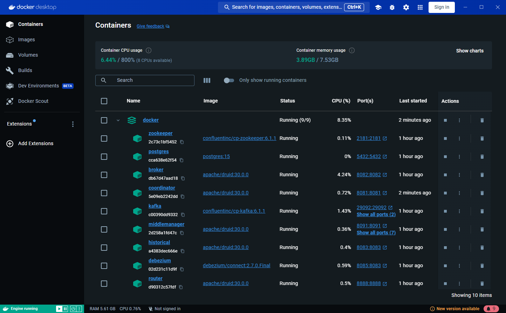
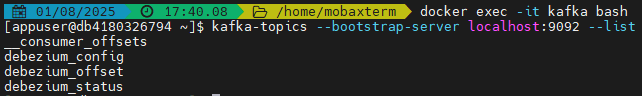
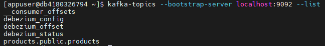
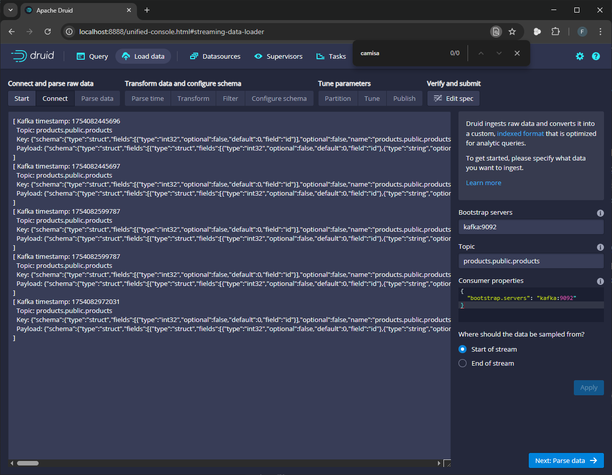
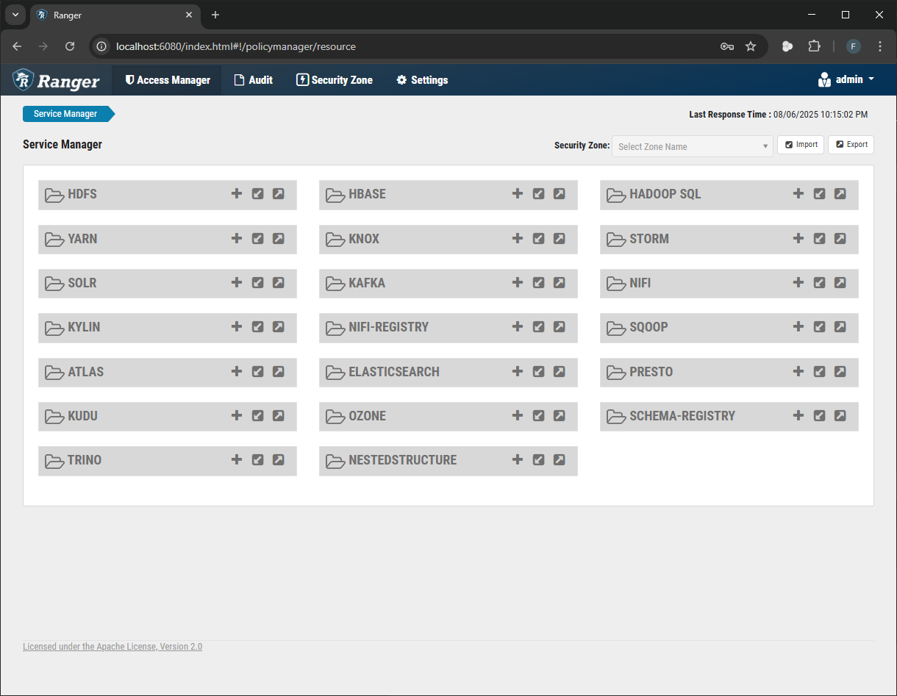

# Pipeline de Dados em Tempo Real com PostgreSQL, Debezium, Kafka e Druid via Docker-Compose


## Índice

1. [Objetivo](#1-objetivo)
2. [Componentes](#2-componentes)
3. [Infraestrutura Utilizada](#3-infraestrutura-utilizada)
4. [Arquitetura Docker Compose](#4-arquitetura-docker-compose)
   * Tabela de Produtos, Portas, Versões e Observações
5. [Guia de Uso Local](#5-guia-de-uso-local)
   * Pré-requisitos
   * Instalação
   * Teste do Laboratório
6. [Conclusão](#6-conclusão)
7. [Referências](#7-referências)

---

## 1. Objetivo

Criar um fluxo streaming iniciando no PostgreSQL, onde a inserção de dados em uma tabela será capturada pelo Debezium, enviada ao Kafka e consumida pelo Druid para visualização e análise.

Como recurso adicional, foram incluídos o Apache Ranger (para controle de acesso e auditoria) e o Solr (como backend de auditoria).

---

## 2. Componentes

* **PostgreSQL**: Base de dados relacional que serve como origem dos dados a serem capturados.
* **Debezium**: Ferramenta de captura de dados em tempo real (CDC) que detecta alterações no PostgreSQL via replicação lógica e publica no Kafka.
* **Kafka**: Sistema de mensageria distribuída que recebe os eventos do Debezium e os distribui para consumidores.
* **Zookeeper**: Serviço de coordenação usado pelo Kafka para gerenciamento de metadados e orquestração dos brokers.
* **Druid**: Plataforma analítica que consome os tópicos do Kafka e permite a visualização dos dados em tempo real através de dashboards.
* **Apache Ranger**: Serviço centralizado de políticas de segurança e auditoria para componentes do ecossistema Hadoop, como Kafka e Druid.
* **Apache Solr**: Armazenamento das auditorias geradas pelo Ranger.

---

## 3. Infraestrutura Utilizada

* Servidor Virtual: 16GB RAM, 40GB Disco, 2 vCPU.

---

## 4. Arquitetura Docker Compose


### Tabela de Produtos, Portas, Versões e Observações

| Produto             | Porta(s)                 | Versão | Observação                                                                                                                                        |
| ------------------- | ------------------------ | ------ | ------------------------------------------------------------------------------------------------------------------------------------------------- |
| PostgreSQL          | 5432:5432                | 15     | `wal_level=logical` habilitado para replicação lógica.                                                                                            |
| Zookeeper           | 2181:2181                | 6.1.1  | Imagem `confluentinc/cp-zookeeper`. Compatível com Zookeeper 3.7.2.                                                                               |
| Kafka               | 29092:29092, 29093:29093 | 6.1.1  | Imagem `confluentinc/cp-kafka`. Compatível com Kafka 2.8.2. Configurado com múltiplos listeners (`PLAINTEXT`, `PLAINTEXT_HOST`, `PLAINTEXT_EXT`). |
| Debezium            | 8085:8083                | 2.7    | Serviço de captura CDC.                                                                                                                           |
| Druid Coordinator   | 8081:8081                | 30.0.0 | Gerencia segmentação de dados.                                                                                                                    |
| Druid Broker        | 8082:8082                | 30.0.0 | Intermediário de consultas.                                                                                                                       |
| Druid Historical    | 8083:8083                | 30.0.0 | Armazena dados segmentados.                                                                                                                       |
| Druid MiddleManager | 8091:8091, 8100–8105     | 30.0.0 | Processa ingestões.                                                                                                                               |
| Druid Router        | 8888:8888                | 30.0.0 | Interface web e roteamento de APIs.                                                                                                               |
| Apache Ranger Admin | 6080:6080                | 2.4.0  | Interface de administração de políticas de segurança e auditoria.                                           |
| Apache Ranger MySQL | 3306:3306                | 8.0.33 | Banco de dados para persistência de configurações do Ranger.                                               |
| Apache Solr         | 8983:8983                | 8.11.2 | Backend para logs de auditoria do Ranger.                                                                  |

---


🔎 *Observação:*

**Confluentinc**: Distribuição da Confluent que integra Kafka e Zookeeper com ferramentas adicionais. A imagem `confluentinc/cp-kafka:6.1.1` **inclui Kafka 2.8.2 e Zookeeper 3.7.2**, de acordo com a [tabela de interoperabilidade da Confluent](https://docs.confluent.io/platform/6.1/installation/versions-interoperability.html#interoperability-versions).


<div align="center">
  
  <p><em>Figura 1: Containers Docker</em></p>
</div>

---

## 5. Guia de Uso

### Pré-requisitos

* Docker
* Docker Compose
* Git

### Instalação

1. Clone o projeto:

```bash
git clone https://github.com/filipe-oliv95/kafka-druid-pipeline.git
cd kafka-druid-pipeline
```

2. Suba os containers:

```bash
docker compose up -d
```

### Teste do Laboratório

#### Criação da Tabela

Acesse o container PostgreSQL e crie a tabela de exemplo:

```bash
docker exec -it postgres psql -U druid -d druid

CREATE TABLE products (
  id SERIAL PRIMARY KEY,
  name TEXT NOT NULL,
  price DECIMAL
);
```

#### Criação do Conector Debezium

Execute o comando abaixo em um terminal Linux para criar o conector:

```bash
curl -X POST http://localhost:8085/connectors \
  -H "Content-Type: application/json" \
  -d '{
    "name": "postgres-products-connector",
    "config": {
      "connector.class": "io.debezium.connector.postgresql.PostgresConnector",
      "plugin.name": "pgoutput",
      "database.hostname": "postgres",
      "database.port": "5432",
      "database.user": "druid",
      "database.password": "FoolishPassword",
      "database.dbname": "druid",
      "database.server.name": "druidserver",
      "table.include.list": "public.products",
      "slot.name": "products_slot",
      "publication.autocreate.mode": "filtered",
      "database.include.schema.changes": "false",
      "tombstones.on.delete": "false",
      "key.converter": "org.apache.kafka.connect.json.JsonConverter",
      "key.converter.schemas.enable": "false",
      "value.converter": "org.apache.kafka.connect.json.JsonConverter",
      "value.converter.schemas.enable": "false",
      "topic.prefix": "products",
      "decimal.handling.mode": "double"
    }
  }'
```

> Obs: para excluir o conector:
>
> ```bash
> curl -X DELETE http://localhost:8085/connectors/postgres-products-connector  
> ```


#### Verificação de Tópicos Kafka

```bash
docker exec -it kafka bash
kafka-topics --bootstrap-server localhost:9092 --list
```

<div align="center">
  
  <p><em>Figura 2: Tópicos Kafka padrão</em></p>
</div>

#### Inserção de Dados no PostgreSQL

```bash
docker exec -it postgres psql -U druid -d druid

INSERT INTO products (name, price) VALUES
('Terno', 500.00);
```

#### Verificação do Tópico Kafka

```bash
docker exec -it kafka bash
kafka-topics --bootstrap-server localhost:9092 --list
```

<div align="center">
  
  <p><em>Figura 3: Novo tópico Kafka criado</em></p>
</div>


#### Consumindo Tópicos no Druid

# Consumindo Tópicos no Druid

1. **Acesse a interface do Druid**

      Abra o navegador e vá até o console do Druid:  
      [http://localhost:8888/](http://localhost:8888/)

2. **Inicie o processo de ingestão de dados via Kafka**

      No menu lateral, vá em:  
      **Load Data** → **Streaming** → **Kafka**

3. **Configure a conexão com o Kafka**

      Preencha os seguintes campos:

      - `Bootstrap servers`: `kafka:9092`  
      > Endereço do broker Kafka que o Druid irá se conectar.

      - `Topic`: `products.public.products`  
      > Nome do tópico Kafka que contém os dados a serem consumidos.

      Após preencher, clique em **Apply**.

      <div align="center">
         
         <p><em>Figura 4: Configuração do tópico Kafka no Druid</em></p>
      </div>

4. **Avance para o próximo passo**

      Clique em **Next: Parse Data** para continuar com a definição do formato dos dados recebidos.

5. **Parse Data**

      Os dados estão no formato Debezium Envelope. Você precisa flattenar os campos de `payload.after`.

      - **Data format:** json
      - Clique em **Flatten JSON**

      No painel de "Parsed Fields", clique em **Add flatten field** e adicione os seguintes campos:

      | Name      | JSONPath         |
      |-----------|------------------|
      | id        | `$.after.id`     |
      | name      | `$.after.name`   |
      | price     | `$.after.price`  |
      | ts_ms     | `$.ts_ms`        |

      Clique em **Apply** e depois em **Next: Parse time**.

6. **Parse Time**

      Você pode usar o timestamp do evento Debezium:

      - Selecione a coluna `ts_ms` e clique em **Next: Transform**

7. **Transformações (opcional)**

      Aqui é possível aplicar transformações nos dados antes da ingestão, como renomear colunas, aplicar filtros ou expressões.

      - Se não for necessário transformar os dados neste momento, apenas clique em **Next: Filter**.

8. **Filtros (opcional)**

      Permite filtrar os dados que serão ingeridos, com base em condições nos campos.

      - Caso deseje ingerir todos os dados, clique diretamente em **Next: Configure schema**.

9. **Configure schema**

      Clique em **Explicitly specify schema** e defina as seguintes configurações:

      | Column Name | Type   |
      |-------------|--------|
      | id          | LONG   |
      | name        | STRING |
      | price_raw   | DOUBLE |
      | scale       | LONG   |
      | ts_ms       | LONG   |

      Após configurar, clique em **Next: Tune**.

10. **Partition**

      - Segment granularity: **hour**
      - Query granularity: **none** ou **minute**
      - Rollup: **false** (caso você queira armazenar todos os eventos exatamente como vieram)

         Clique em **Next: Tune**.

11. **Tune**

      Deixe o padrão e clique em **Next: Publish**.

12. **Publicação da Tarefa de Ingestão**

      - Dê um nome à ingestão, como `products_stream`.
      - Revise todas as configurações.
      - Clique em **Submit** para iniciar o processo.

13. **Acesso ao Datasource**

      Após a publicação da tarefa de ingestão, o novo datasource estará disponível na aba **Datasources** da interface do Druid.

      Você poderá:

      - Visualizar os dados diretamente na interface do Druid.
      - Utilizar a aba **Query** para executar comandos SQL.
      - Acessar o datasource via API utilizando a [SQL API do Druid](https://druid.apache.org/docs/latest/api-reference/sql-api).
---

#### Interface Ranger

Após subir os serviços, acesse a interface web do Apache Ranger: [http://localhost:6080/](http://localhost:6080/)
```bash
usuário: admin
senha: Ranger1234
```

<div align="center">
   
   <p><em>Figura 5: Interface do Apache Ranger</em></p>
</div>

---

## 6. Conclusão

Este projeto demonstrou, de forma prática, a construção de um fluxo de dados em tempo real utilizando tecnologias modernas de streaming:

* **PostgreSQL** como fonte de dados transacionais;
* **Debezium** para captura de alterações (CDC) via replicação lógica;
* **Kafka** como barramento de eventos distribuído;
* **Druid** como plataforma analítica para ingestão e visualização de dados.

A arquitetura implementada permite que qualquer alteração na base PostgreSQL seja refletida em tempo real nos dashboards do Druid. Essa abordagem é altamente escalável, ideal para sistemas de monitoramento, análise de logs, métricas de negócios, entre outros casos de uso orientados a eventos.

Com o ambiente todo orquestrado via Docker Compose, a replicação do laboratório em outras máquinas é simples, facilitando testes, aprendizado e expansão para projetos maiores.

Para controle de segurança e auditoria centralizada, a stack inclui também o Apache Ranger e o Solr, oferecendo rastreabilidade das ações e políticas refinadas de acesso.

---

## 7. Referências

 [Kafka Docker-Compose Reference - GitHub](https://github.com/adityajoshi12/kafka-nodejs)

 [Druid Docker-Compose Reference - GitHub](https://github.com/apache/druid/tree/33.0.0#)

 [Ranger Docker-Compose Reference - GitHub](https://github.com/takezoe/ranger-docker/)

 [Druid Documentation](https://druid.apache.org/docs/latest/tutorials/docker)

 [SQL API do Druid](https://druid.apache.org/docs/latest/api-reference/sql-api).